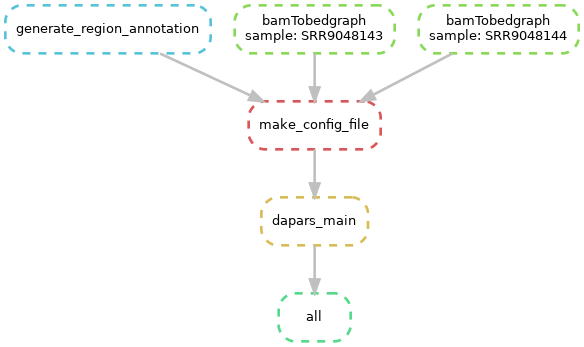

# A worlflow for Alternative polyadenylation (APA) events analysis in 3'UTR

Last update: 2020-01-08

This is a workflow for analyzing APA events in 3'UTR with [Dapars](http://lilab.research.bcm.edu/dldcc-web/lilab/zheng/DaPars_Documentation/html/DaPars.html). It compares two conditions(e.g. Tumor/Normal) with multiple samples and reports the predicted proximal APA sites

## Environment and dependencies: 
* snakemake (v5.5.4)
* R (v3.6.2)
* 3utr.yml
  * python (v2.7.15)
  * bedtools (v2.29.2)
  * numpy (v1.16.5)
  * rpy2 (v2.8.6)
  * scipy (v1.2.1)

## Input
* A sample_list.txt
> Fisrt row: comma-separated sample list of group1(Tumor/Treatment);
> Second row: comma-separated samlple list of group2(Normal/Control).
* A `datasets` directory condtains aligned samples in BAM format.
* A whole gene model in BED format. The gene model can be download form [UCSC](http://genome.ucsc.edu/cgi-bin/hgTables?command=start). See *hg38_refseq_whole_gene.bed*.
* A mapping of transcript ID(RefSeq) to gene symbol. This can be extracted from UCSC tables. See *hg38_refseq_id_UCSC.txt*.

## Usage
`snakemake -p --use-conda`

## Output
A txt file contains APA analysis result from Dapars.

Citation
---
* Masamha, C.P., Xia, Z., Yang, J., Albrecht, T.R., Li, M., Shyu, A., Li, W., Wagner, E.J. 2014. CFIm25 links Alternative Polyadenylation to Glioblastoma Tumor Suppression. Nature, 510:412-416.

* Xia, Z., Donehower, L.A., Wheeler, D.A., Cooper, T.A., Neilson, J.R., Wagner E.J., Li, W. 2014. Dynamic Analyses of Alternative Polyadenylation from RNA-Seq Reveal 3'-UTR Landscape Across 7 Tumor Types. Nature Communications, 5:5274
Xia, Z., Donehower, L., Cooper, T. et al. Dynamic analyses of alternative polyadenylation from RNA-seq reveal a 3′-UTR landscape across seven tumour types. Nat Commun 5, 5274 (2014) doi:10.1038/ncomms6274
Dapars GitHub: https://github.com/ZhengXia/dapars
